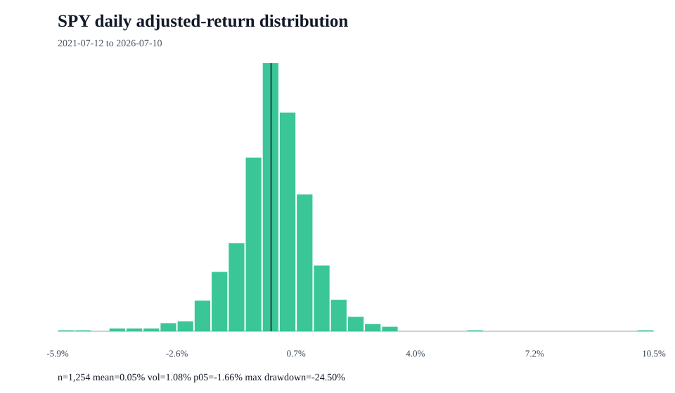

# SPY return distribution

## Measurement contract

- Proxy: SPY is an investable S&P 500 proxy, not the index itself.
- Price field: adjusted close
- Frequency: daily simple returns
- Period: 2021-07-12 to 2026-07-10
- Observations: 1,255 prices and 1,254 returns

## Distribution summary

| Statistic | Value |
| --- | ---: |
| Mean daily return | 0.05% |
| Median daily return | 0.07% |
| Daily volatility | 1.08% |
| Annualized return | 13.14% |
| Annualized volatility | 17.17% |
| Positive days | 54.23% |
| 1st percentile | -2.93% |
| 5th percentile | -1.66% |
| Historical expected shortfall (95%) | -2.47% |
| Worst day | -5.85% |
| Best day | 10.50% |
| Maximum drawdown | -24.50% |
| Skewness | 0.312 |
| Excess kurtosis | 8.985 |

## Limits

- Historical observations do not forecast future returns.
- Daily sampling does not describe intraday or monthly distributions.
- The sample can mix materially different market regimes.
- Yahoo Finance is an unofficial source and may revise or omit data.

## Source

- URL: https://query1.finance.yahoo.com/v8/finance/chart/SPY?range=5y&interval=1d&events=history
- Retrieved: 2026-07-13T06:03:21+00:00

> Research and decision support only; not financial advice, a personalized recommendation, portfolio management, or a guarantee of returns.
