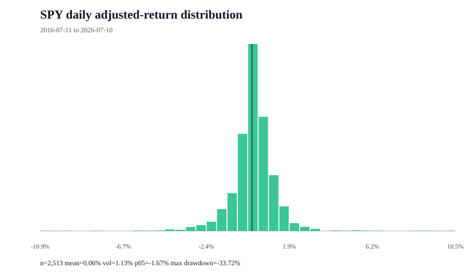

# SPY return distribution

## Measurement contract

- Proxy: SPY is an investable S&P 500 proxy, not the index itself.
- Price field: adjusted close
- Frequency: daily simple returns
- Period: 2016-07-11 to 2026-07-10
- Observations: 2,514 prices and 2,513 returns

## Distribution summary

| Statistic | Value |
| --- | ---: |
| Mean daily return | 0.06% |
| Median daily return | 0.07% |
| Daily volatility | 1.13% |
| Annualized return | 15.35% |
| Annualized volatility | 17.92% |
| Positive days | 55.39% |
| 1st percentile | -3.24% |
| 5th percentile | -1.67% |
| Historical expected shortfall (95%) | -2.74% |
| Worst day | -10.94% |
| Best day | 10.50% |
| Maximum drawdown | -33.72% |
| Skewness | -0.314 |
| Excess kurtosis | 14.979 |

## Limits

- Historical observations do not forecast future returns.
- Daily sampling does not describe intraday or monthly distributions.
- The sample can mix materially different market regimes.
- Yahoo Finance is an unofficial source and may revise or omit data.

## Source

- URL: https://query1.finance.yahoo.com/v8/finance/chart/SPY?range=10y&interval=1d&events=history
- Retrieved: 2026-07-13T05:23:52+00:00

> Research and decision support only; not financial advice, a personalized recommendation, portfolio management, or a guarantee of returns.
