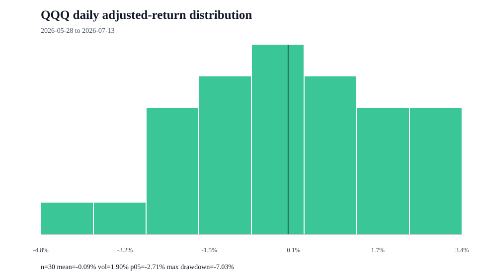

# QQQ return distribution

## Measurement contract

- Proxy: QQQ is analyzed as the selected market proxy.
- Price field: adjusted close
- Frequency: daily simple returns
- Period: 2026-05-28 to 2026-07-13
- Observations: 31 prices and 30 returns

## Distribution summary

| Statistic | Value |
| --- | ---: |
| Mean daily return | -0.09% |
| Median daily return | 0.02% |
| Daily volatility | 1.90% |
| Annualized return | -23.49% |
| Annualized volatility | 30.09% |
| Positive days | 50.00% |
| 1st percentile | -4.36% |
| 5th percentile | -2.71% |
| Historical expected shortfall (95%) | -4.05% |
| Worst day | -4.80% |
| Best day | 3.38% |
| Maximum drawdown | -7.03% |
| Skewness | -0.220 |
| Excess kurtosis | -0.138 |

## Limits

- Historical observations do not forecast future returns.
- Daily sampling does not describe intraday or monthly distributions.
- The sample can mix materially different market regimes.
- Yahoo Finance is an unofficial source and may revise or omit data.

## Source

- URL: https://query1.finance.yahoo.com/v8/finance/chart/QQQ?range=3mo&interval=1d&events=history
- Retrieved: 2026-07-14T03:02:22+00:00

> Research and decision support only; not financial advice, a personalized recommendation, portfolio management, or a guarantee of returns.
