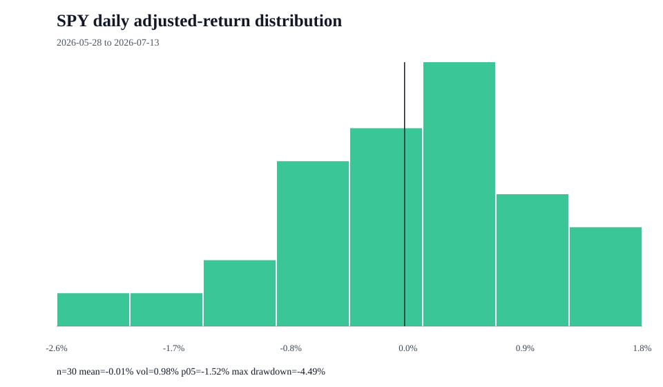

# SPY return distribution

## Measurement contract

- Proxy: SPY is an investable S&P 500 proxy, not the index itself.
- Price field: adjusted close
- Frequency: daily simple returns
- Period: 2026-05-28 to 2026-07-13
- Observations: 31 prices and 30 returns

## Distribution summary

| Statistic | Value |
| --- | ---: |
| Mean daily return | -0.01% |
| Median daily return | 0.04% |
| Daily volatility | 0.98% |
| Annualized return | -3.83% |
| Annualized volatility | 15.61% |
| Positive days | 50.00% |
| 1st percentile | -2.29% |
| 5th percentile | -1.52% |
| Historical expected shortfall (95%) | -2.08% |
| Worst day | -2.58% |
| Best day | 1.76% |
| Maximum drawdown | -4.49% |
| Skewness | -0.322 |
| Excess kurtosis | 0.292 |

## Limits

- Historical observations do not forecast future returns.
- Daily sampling does not describe intraday or monthly distributions.
- The sample can mix materially different market regimes.
- Yahoo Finance is an unofficial source and may revise or omit data.

## Source

- URL: https://query1.finance.yahoo.com/v8/finance/chart/SPY?range=3mo&interval=1d&events=history
- Retrieved: 2026-07-14T03:02:22+00:00

> Research and decision support only; not financial advice, a personalized recommendation, portfolio management, or a guarantee of returns.
